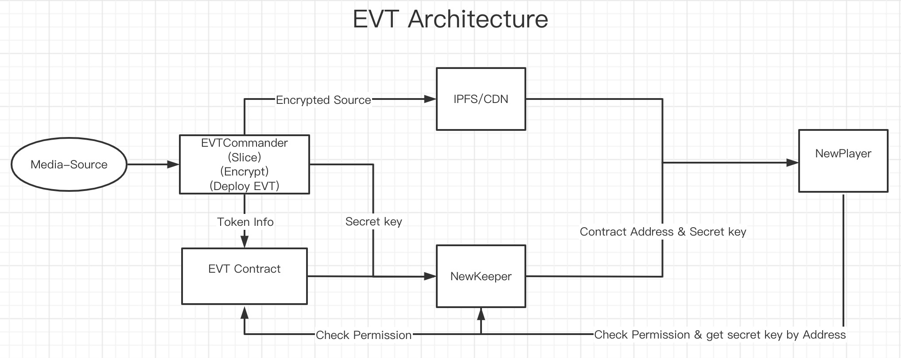

# EVT Guide

## 1. EVT Architecture

## 2 EVT Components & Tools

### 2.1 Movie Commander
- 切片，加密视频资源...

### 2.2 NewKeeper

### 2.3 NewPlayer

### 2.4 [evt-libs](https://github.com/newtonproject/evt-lib)

Library for EVT development.
- Standard implementation of EVT
- Example contracts for using EVT
- Factory for EVT industry application

### 2.5 [evt-toolchain](https://github.com/newtonproject/evt-toolchain)

In this toolchain, you can use some simple shell command line to deploy contract, create EVT, call EVT Encryption functions, call EVT Variable functions. etc.

## 3 How to integration

- Upload Media Source(mp4,...) to Movie Commander.

- Movie Commander job:
  - create new wallet; 
  - recharge `NEW` to wallet address;
  - slice media source;
  - generate random secret;
  - use `secret key` encrypt `sliced media source`;
  - upload `encrypted media source ` to CDN/IPFS/...;
  - deploy media source evt contract;
  - register `secret key` and `evt contract` to `NewKeeper`;
  - get `evt contract address`.

- User call `mint` to mint EVT;

- User get `token uri` from `evt contract address`, then fetch `secret key` from `NewKeeper`;

- Provide `player link` & `secret key` to `NewPlayer` and you can play the `media source`.

### 3.1 Android

### 3.2 iOS

### 3.3 Server

## 4. Build Your EVT
